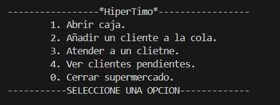
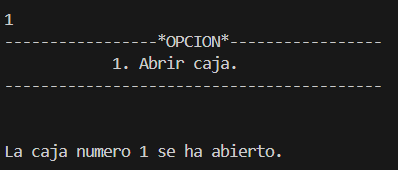
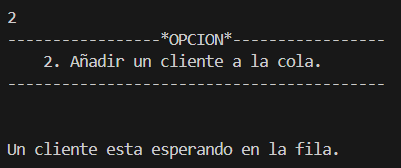
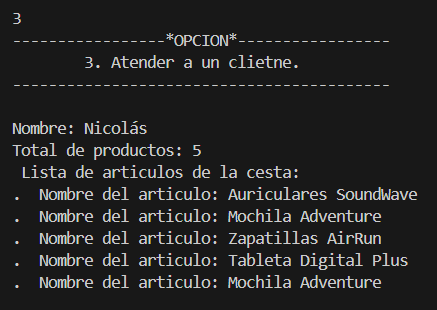
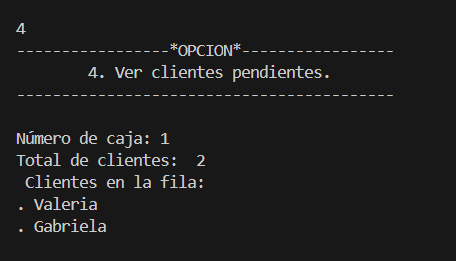
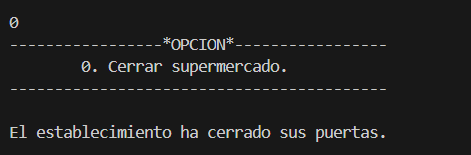

# Bienvenido al proyecto "HiperTimo"

Este es un proyecto a petición de la línea de supermercados Hiperdino para evaluar la viabilidad de nuestro servicio de desarrollo para crear un software o derivados del mismo.

## Guía de Usuario

Esta guía explica la funcionalidad del menú gráfico:

1. **Abrir Caja:** Esta opción indica al usuario que está listo para ofrecer servicio a los clientes.

2. **Crear Cliente:** Se crea un cliente con un nombre y una variedad de productos aleatorios, tanto en cantidad como en tipo.

3. **Atender Cliente:** Se atiende al primer cliente de la fila, siguiendo un sistema FIFO (Primero en Entrar, Primero en Ser Atendido). También se muestra el nombre del cliente y los productos seleccionados.

4. **Clientes sin Atender:** Muestra por pantalla los clientes que aún no han sido atendidos.

0. **Cerrar Programa:** Cierra el programa, asegurándose primero de que no queden clientes sin atender. En caso de haber clientes en espera, el programa no se cerrará.

Espero que les halla servido de ayuda.